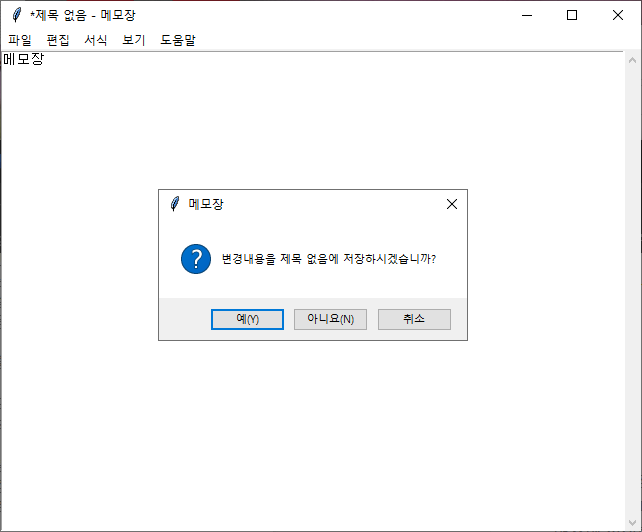

# python mini project

해당 프로젝트들은 [inflearn](https://www.inflearn.com/)의 나도코딩님의 강의를 듣고 진행했습니다.

## pygame
* [파이썬 무료 강의 (활용편1) - 추억의 오락실 게임 만들기](https://www.inflearn.com/course/%EB%82%98%EB%8F%84%EC%BD%94%EB%94%A9-%ED%8C%8C%EC%9D%B4%EC%8D%AC-%ED%99%9C%EC%9A%A9%ED%8E%B8-1)

## tkinter
* [파이썬 무료 강의 (활용편2) - GUI 프로그래밍](https://www.inflearn.com/course/%EB%82%98%EB%8F%84%EC%BD%94%EB%94%A9-%ED%8C%8C%EC%9D%B4%EC%8D%AC-%ED%99%9C%EC%9A%A9%ED%8E%B8-2)

## scraping
* [파이썬 무료 강의 (활용편3) - 웹 스크래핑](https://www.inflearn.com/course/%ED%8C%8C%EC%9D%B4%EC%8D%AC-%EC%9B%B9-%EC%8A%A4%ED%81%AC%EB%9E%98%ED%95%91)

